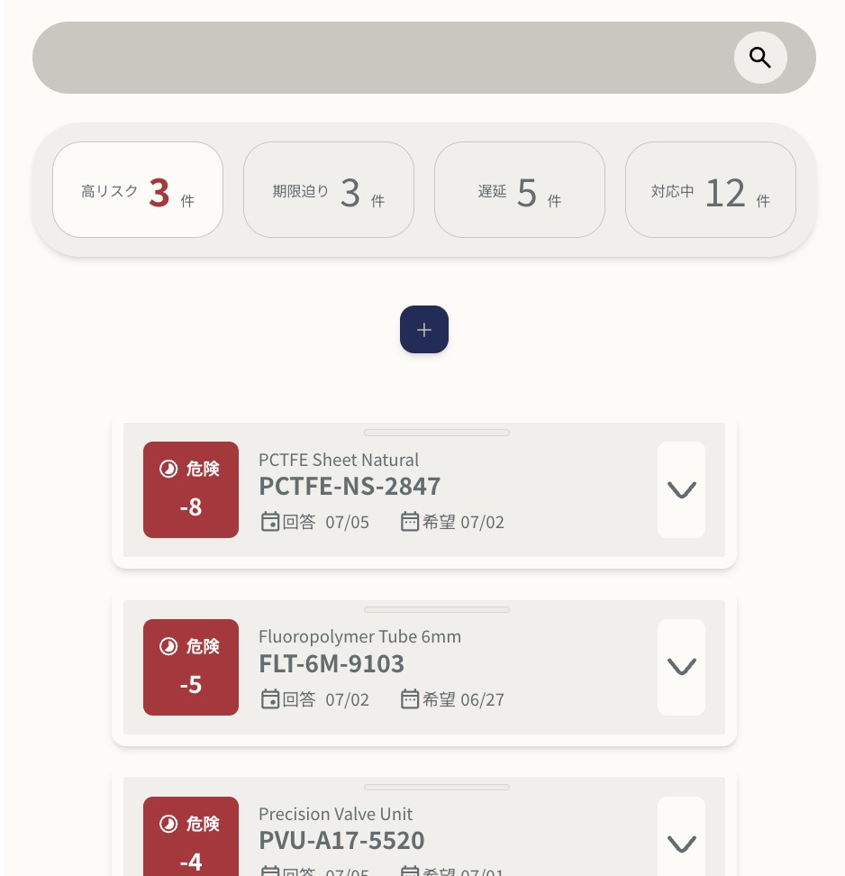

# CMT App

## 概要

CMT Appは、購買・調達業務における納期調整案件を管理するための業務支援アプリです。

仕入先からの回答納期、希望納期、限界納期、遅延日数、対応メモなどを案件ごとに整理し、対応すべき案件を一覧で確認できるようにしています。

## デモ

[公開デモを見る](https://cmt-app-zeta.vercel.app/)

## スクリーンショット



## 制作背景

現職では、チャット、メール、定期配信される遅延状況リストなど、複数の経路から納期調整案件が発生します。

案件数が増えると、対応状況や優先順位の把握が属人的になりやすく、確認漏れや対応遅れにつながる可能性があります。

そこで、各案件の状況をひとつの画面で整理し、次に確認すべき案件を判断しやすくするために、Webアプリとして再設計しました。

## 主な機能

- 案件カードによる納期調整案件の一覧管理
- 品番、品名、仕入先などによる検索
- ステータス別の表示切り替え
- 並び替え
- ドラッグ&ドロップによる表示順変更
- 高リスク、期限迫り、遅延、対応中の件数集計
- デモデータの復元
- SQLiteへのデータ保存

## 使用技術

| 領域              | 技術         |
| ----------------- | ------------ |
| フレームワーク    | Next.js      |
| 言語              | TypeScript   |
| スタイリング      | Tailwind CSS |
| ORM               | Prisma       |
| データベース      | SQLite       |
| ドラッグ&ドロップ | dnd-kit      |

## 工夫した点

### 実務フローに合わせた操作設計

チャット、メール、遅延リストなど複数の経路から発生する案件を、ひとつの画面で確認・編集できるようにしました。

画面遷移を増やさず、一覧上で状況確認と編集を行えるようにすることで、日々の確認作業に組み込みやすい構成を意識しました。

### 実務上の優先順位を見える化

納期調整案件を単に一覧表示するだけでなく、遅延日数や限界納期をもとに「高リスク」「期限迫り」「遅延」「対応中」として分類し、対応優先度を判断しやすくしました。

### カード型UIによる情報整理

案件ごとに必要な情報をカード単位で整理し、品番、仕入先、希望納期、回答納期、限界納期、原因、メモを一覧上で確認できるようにしました。

### API層とDB保存の分離

画面側から直接データベースを操作せず、API Routeを経由してPrisma / SQLiteに保存する構成にしました。

画面、API、データベースの責務を分けることで、将来的な機能追加やElectron化を見据えた構成にしています。

## 今後の改善予定

- Electron化によるローカル業務アプリ化
- 集計カードクリックによる一覧絞り込み
- 仕入先別、原因別、月別推移などのダッシュボード追加
- デモ版と実務版の保存方式切り替え
- UIアニメーションとデザイントークンの整理
- マジックナンバーの整理によるメンテナンス性の向上
- 仕入先情報のデータベース管理
- 別途制作のメール作成支援ツール統合

## 起動方法

```bash
npm install
npx prisma migrate dev
npm run dev
```

ブラウザで以下を開きます。

```bash
http://localhost:3000
```

## デモ・データについて

本アプリでは実務データを使用せず、動作確認用の架空デモデータを用意しています。

「デモデータを復元」ボタンから、サンプル案件を初期状態に戻すことができます。


